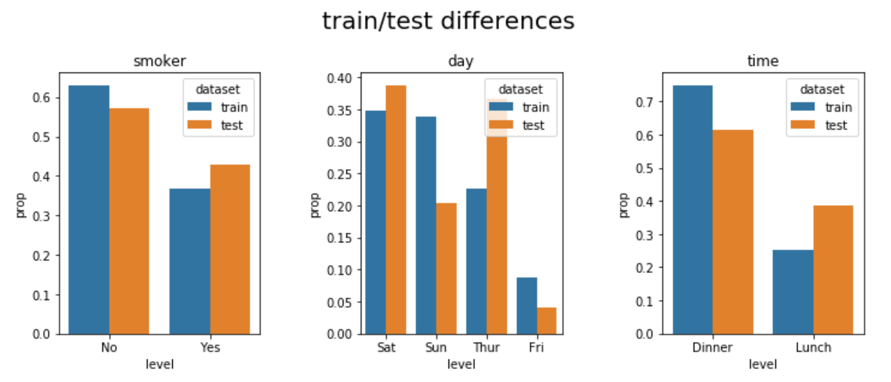
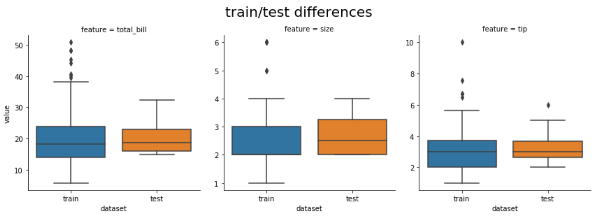
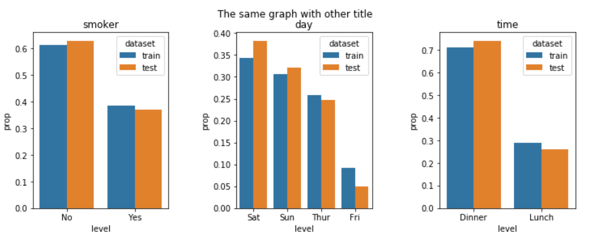

=============
traintestdiff
=============

.. image:: https://img.shields.io/pypi/v/traintestdiff.svg
        :target: https://pypi.python.org/pypi/traintestdiff

.. image:: https://img.shields.io/github/license/mashape/apistatus.svg
        :alt: License

.. image:: https://readthedocs.org/projects/traintestdiff/badge/?version=latest
        :target: https://traintestdiff.readthedocs.io/en/latest/?badge=latest
        :alt: Documentation Status

Installation
------------

.. code-block:: bash

        $ pip install traintestdiff

Documentation and Examples
--------------------------

You can find the documentation in https://traintestdiff.readthedocs.io and a
Jupyer notebook in `example <https://github.com/alejandrodumas/traintestdiff/blob/master/examples/TrainTestDiffExamples.ipynb>`_

Overview
--------

**traintestdiff** provides a simple way to explore differences on your train, validation and test data:
it's main entry point is the class ``TrainTestDiff`` whose only argument is a dict of datasets you would
like to explore.

In this case we're going to explore the **tips** dataset provided by Seaborn

.. code:: python

        import pandas as pd
        import seaborn as sns

        from traintestdiff import TrainTestDiff

        tips = sns.load_dataset("tips")
        
        # Let's split our data in train and test
        train=tips.sample(frac=0.8,random_state=0)
        test=tips.drop(train.index)

Once you have your train and test set you're ready to use ``TrainTestDiff``

.. code:: python

        datasets = {'train': train, 'test': test}
        ttd = TrainTestDiff(datasets)

The two main methods are ``plot_cat_diff`` and ``plot_cont_diff``: the first one produces a plot of categorical features,
and the second one a plot of continuous features.

.. code:: python

        long_form, fig1 = ttd.plot_cat_diff(features=['smoker', 'day', 'time'])

With ``plot_cont_diff`` we can explore the continuous features of the datasets

.. code:: python

        longform_cont1, fig2 = ttd.plot_cont_diff(features=["total_bill", "size", "tip"], kind="box")

Long Form data and figures
--------------------------

As you can see from the code, both ``plot_cat_diff`` and ``plot_cont_diff``
return two values: a ``pandas.core.frame.DataFrame`` and a ``matplotlib.figure.Figure``

The idea is to give you a way to explore the data in a tidy format and the figure to tweak 
how it looks. For example, let's change the title:

.. code:: python

        fig1.suptitle("The same graph with other title")
        fig1

